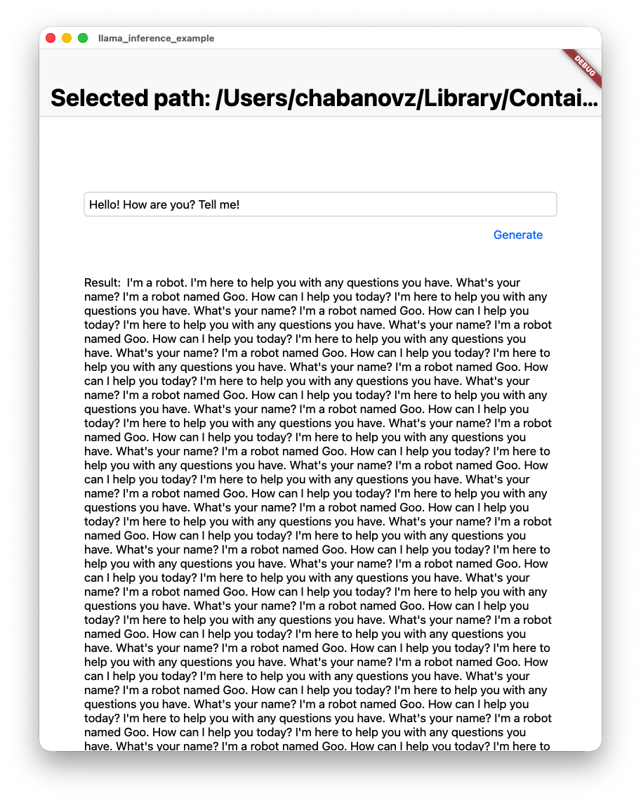

# llama_inference

Dart and Flutter FFI wrapper around `llama.cpp` for running local `GGUF` models on desktop.



## Status

This package is experimental.

The current native bridge is intentionally minimal: it loads a model, runs greedy decoding, and returns the generated bytes through an FFI buffer. It is useful as a starting point, not as a production-ready inference stack.

## Supported Platforms

- macOS
- Linux
- Windows (not tested)

Notes:
- Native assets are built with CMake through Dart build hooks.
- The included Flutter example is currently set up for macOS usage.

## Requirements

- Dart SDK `^3.11.0`
- Flutter SDK for the example app
- CMake available in `PATH`
- A local `.gguf` model file
- On macOS: Xcode command line tools

## Quick Start: Dart Smoke Test

Use the repo-local sample in [`lib/main.dart`](lib/main.dart).

1. Put a `GGUF` model file somewhere on disk.
2. Update the model path in [`lib/main.dart`](lib/main.dart).
3. Run:

```sh
dart run lib/main.dart
```

Expected behavior:
- the native build hook compiles the `llama.cpp` bridge
- the model loads through FFI
- generated text is printed to stdout

## Quick Start: Flutter Example

The example app lets you pick a local `.gguf` file and run inference from a simple macOS UI.

```sh
cd example
flutter clean
flutter run -d macos
```

Notes:
- the selected model file is copied into app support storage
- the macOS runner includes the file-access entitlement required by `file_picker`

## Model Requirements

- format must be `GGUF`
- model path must point to a local file
- compatibility depends on the bundled `llama.cpp` version
- some Ollama blobs may work because they are GGUF files internally, but not every Ollama model variant is compatible

## Package Entry Points

- [`lib/inference.dart`](lib/inference.dart): minimal Dart API used by the example app
- [`lib/main.dart`](lib/main.dart): repo-local smoke test
- [`example/lib/main.dart`](example/lib/main.dart): Flutter macOS example UI

## Project Layout

- [`src/`](src): native bridge and CMake files
- [`src/third_party/llama.cpp/`](src/third_party/llama.cpp): vendored `llama.cpp`
- [`hook/build.dart`](hook/build.dart): native asset build hook
- [`lib/`](lib): generated bindings and Dart wrappers
- [`example/`](example): Flutter example app

## Limitations

- greedy decoding only
- no streaming
- no chat template application
- no sampler configuration
- minimal error handling
- no built-in model download flow
- no mobile packaging workflow yet

The native implementation itself documents this in [`src/llama_dart.cpp`](src/llama_dart.cpp).

## Troubleshooting

### `PlatformException(ENTITLEMENT_NOT_FOUND)` in the example app

This is a macOS sandbox entitlement issue. Rebuild the example app after entitlement changes:

```sh
cd example
flutter clean
flutter run -d macos
```

### `symbol not found` or missing native asset errors

Run the sample from the package root with `dart run` or `flutter run` so build hooks execute and the native library is bundled correctly.

### Model loads but output quality is poor or repetitive

That is expected with the current demo decoder. The package currently uses a minimal greedy generation loop without chat template handling or proper sampling.
